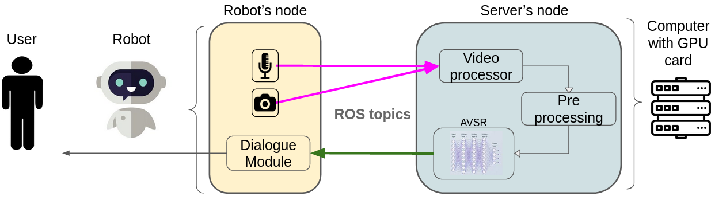

# CHILIpReading

The goal of this project is to achieve a distributed system for fast and accurate audio visual speech recognition (AVSR).

Two computers are used. A robot that will collect the data and a server that will do heavy processing step.

To connect the computers ros environments, you can follow [Husarnet tutorial](https://husarion.com/tutorials/ros-tutorials/5-running-ros-on-multiple-machines/)



# Table of Contents  
[Robot Overview](#ro)  
[Server Overview](#so)  
[Visual speech recognition](#vsr)   
[Installation](#installation)   

<a name="ro"/> 

# Robot Overview

## Visual module
Responsible of taking images and to make sure that their transfer to the Video Module was correctly done.

## Audio module
Responsible of capturing sounds and to make sure that their transfer to the Video Module was correctly done.

## Evaluator
Feature added so that, instead of using the camera and microphone input, the system will use an mp4 video input. It will also take care of saving the processing time and results obtained.

<a name="so"/>

# Server Overview

## State Manager
Ensures that the actual state is well completed before deciding and setting the correct following state. It keeps the process timeline correct at all time and avoid being in non-predicted states.

## Video module
First responsible of receiving the images and sounds sent by the Visual and Audio modules to build a video out of them and then of using the video to get the prediction of the speech of it.

<a name="vsr"/>

# Visual speech recognition (VSR)
This is a forked repositories comming from [[1]](#1). It is used for the VSR part in the Video module.


<a name="installation"/>

# Installation
The following catkin workspace folder structure was adopted for this project:

```bash
├── build
├── devel
├── VSR
└── src
    ├── Audio_module
    ├── Evaluator
    ├── State_Manager
    ├── Video_module
    └── Visual_module
```

The VSR repo can be downloaded anywhere, but you have to setup the following environment path variable:
```cmd
export VSR_DIR=/path/to/vsr/folder/VSR
```

To install the python dependancies, you can clone the .github repo and execute
```cmd
pip install -r requirements.txt
```


## References
<a id="1">[1]</a> 
Ma, Pingchuan and Petridis, Stavros and Pantic, Maja (2021). 
[End-to-end audio-visual speech recognition with conformers](https://github.com/mpc001/Visual_Speech_Recognition_for_Multiple_Languages)
ICASSP 2021-2021 IEEE International Conference on Acoustics, Speech and Signal Processing (ICASSP), 7613-7617.
